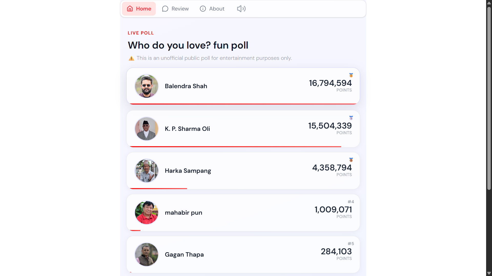

# Kaslejitla

Made for fun with my friends with in 24-hours , within college session.

[live here](https://kaslejitla.pages.dev)


# Stats

- Had **1M+** views on differnt social media platforms
- **12k** overally pages views
- **5k** Daily active users at that time


## Site design


## Tech stack

- React.js , Tailwindcss,Lucide-react
- React Router Dom
- PostHog for analytics
- Supabase for DB
- Node js ,Express.js , Socket.io for realtime
- In-memory js objects for efficient

## ENV example

```bash
VITE_SUPABASE_URL
VITE_SUPABASE_PUBLISHABLE_DEFAULT_KEY
VITE_PUBLIC_POSTHOG_KEY
VITE_PUBLIC_POSTHOG_HOST
VITE_SERVER_URL
```

# Main branch
- Used supabase Realtime **(Postgres changes,Boardcast)**
- Was able to handle 4M realtime requests on free tiar
- React for frontend
- **No custom server**

# Custom branch 
- **Nodejs,Express ,socket.io for server**
- Supabase for Saving changes only
- Saved Changes to DB within 5 minutes interval 
- React for Frontend
- Had many efficiency bugs
- In memory objects for realtime changes

# Optimzed branch
- Fix previous bugs
- **Applied server side Buffering , Throttling , Time based batching**
- NO rate limit because of socket server
- Nodejs,Express ,socket.io for server
- Supabase for Saving changes only
- Saved Changes to DB within 5 minutes interval 
- **Client side Throttling , Buffering**
- In memory objects for realtime changes


# Stop-live branch
- create to end live voting after election ended

---
If you liked this project, give it a ⭐